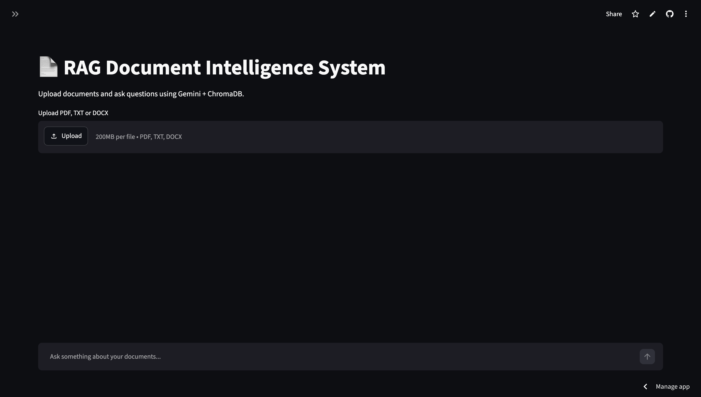
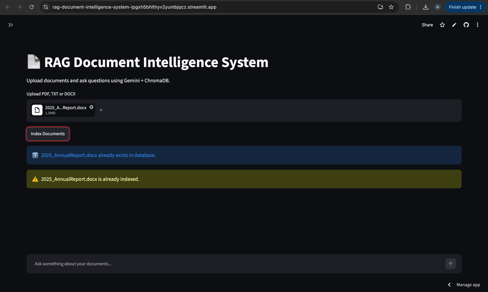
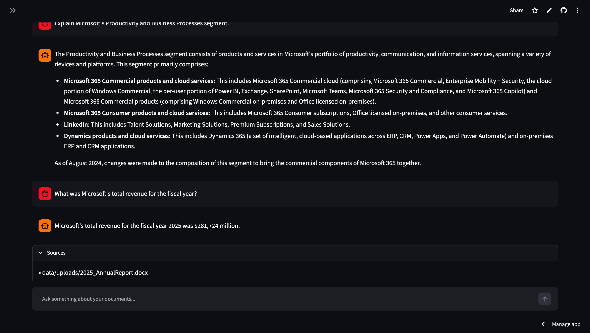

# 📄 RAG Document Intelligence System

A production-ready **Retrieval Augmented Generation (RAG)** application that allows users to upload documents and interact with them using natural language queries.

The system uses **LangChain, Google Gemini, ChromaDB, and HuggingFace embeddings** to perform semantic document search and generate accurate answers based only on uploaded documents.

---

# 🚀 Live Demo

Streamlit Deployment:

(Add your Streamlit Cloud URL here)

---

# 📌 Features

✅ Upload PDF, TXT, and DOCX documents  
✅ Automatic document indexing  
✅ Incremental indexing (avoids duplicate processing)  
✅ Semantic search using vector embeddings  
✅ Persistent ChromaDB vector database  
✅ Google Gemini powered answer generation  
✅ Source document tracking  
✅ Chat history memory  
✅ Hallucination control (answers only from retrieved context)  
✅ Streamlit interactive user interface  

---

# 🏗️ System Architecture

```
                 User
                  |
                  |
          Upload Documents
                  |
                  |
          Document Processing
                  |
        ---------------------
        |        |          |
       PDF      TXT       DOCX
        |
        |
   Text Extraction
        |
        |
   Text Chunking
        |
        |
 HuggingFace Embeddings
        |
        |
   Chroma Vector Database
        |
        |
 User Question
        |
        |
 Semantic Similarity Search
        |
        |
 Retrieved Context
        |
        |
 Google Gemini LLM
        |
        |
 Generated Answer
```

---

# 🛠️ Tech Stack

## Programming Language
- Python

## Frameworks & Libraries

- LangChain
- LangChain Google GenAI
- LangChain Chroma
- LangChain HuggingFace
- Streamlit

## AI Models

- Google Gemini
- Sentence Transformers Embeddings

## Vector Database

- ChromaDB

## Document Processing

- PyPDF
- Docx2txt

---

# 📂 Project Structure

```
rag-document-intelligence-system/

│
├── app.py
├── config.py
├── requirements.txt
├── README.md
│
├── utils/
│   ├── llm.py
│   ├── vectorstore.py
│   ├── embeddings.py
│   ├── indexer.py
│   ├── retriever.py
│   ├── splitter.py
│   ├── prompts.py
│   ├── parser.py
│   └── file_tracker.py
│
├── data/
│   └── uploads/
│
├── vector_db/
│   └── chroma_db/
│
└── metadata/
    └── indexed_files.json
```

---

# ⚙️ Installation

## 1. Clone Repository

```bash
git clone https://github.com/naveenkkr75/rag-document-intelligence-system.git
```

Move into the project folder:

```bash
cd rag-document-intelligence-system
```

---

## 2. Create Virtual Environment

```bash
python -m venv .venv
```

Activate environment:

### Mac/Linux

```bash
source .venv/bin/activate
```

### Windows

```bash
.venv\Scripts\activate
```

---

## 3. Install Dependencies

```bash
pip install -r requirements.txt
```

---

# 🔑 Environment Variables

Create a file:

```
.env
```

Add your Gemini API key:

```env
GOOGLE_API_KEY=your_gemini_api_key
```

---

# ▶️ Run Application

Start Streamlit:

```bash
streamlit run app.py
```

Application will open:

```
http://localhost:8501
```

---

# 📖 How To Use

### Step 1: Upload Documents

Supported formats:

- PDF
- TXT
- DOCX


### Step 2: Index Documents

Click:

```
🚀 Index Documents
```

The system will:

- Extract text
- Split documents into chunks
- Generate embeddings
- Store vectors in ChromaDB


### Step 3: Ask Questions

Example:

```
What is the revenue mentioned in the report?
```

The system retrieves relevant document sections and generates an answer.

---

# 🧠 RAG Pipeline Explanation

## 1. Document Loading

Documents are loaded using LangChain document loaders.

Supported:

- PyPDFLoader
- TextLoader
- Docx2txtLoader


## 2. Text Chunking

Large documents are divided into smaller chunks using:

```
RecursiveCharacterTextSplitter
```


## 3. Embeddings

Each chunk is converted into a numerical vector using:

```
sentence-transformers/all-MiniLM-L6-v2
```


## 4. Vector Storage

Embeddings are stored inside:

```
ChromaDB
```


## 5. Retrieval

When a user asks a question:

- Query embedding is created
- Similar document chunks are retrieved


## 6. Generation

Retrieved context is passed to:

```
Google Gemini
```

to generate the final response.

---

# 🧪 Example Questions

For a company annual report:

```
What was the company's revenue?

Who is the CEO?

What are the major risks?

Summarize the financial performance.

What are the future growth strategies?
```

---

# 📸 Screenshots

## Upload Interface




## Document Indexing




## Question Answering



# 🔒 Security Notes

The following files are excluded from GitHub:

```
.env
.venv/
data/uploads/
vector_db/
metadata/indexed_files.json
```

Uploaded documents remain local to each deployment.

---

# 🚀 Deployment

The application is deployed using:

- Streamlit Cloud
- GitHub Repository


Deployment steps:

1. Push code to GitHub
2. Connect repository with Streamlit Cloud
3. Add secrets:

```
GOOGLE_API_KEY="your_api_key"
```

4. Deploy application

---

# 🔮 Future Improvements

- Multi-user authentication
- Cloud storage integration
- Advanced reranking models
- Conversation-aware retrieval
- Support for more document formats
- OCR support for scanned PDFs

---

# 👨‍💻 Author

**Naveen Kumar**

GitHub:

https://github.com/naveenkkr75

---

# ⭐ If you find this project useful

Give the repository a star ⭐